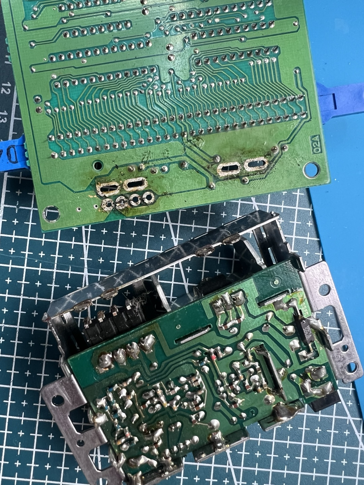

fc-av-mod
=========

This is yet another Famicom AV mod with following features:
- Composite Video and Audio output
- USB-C Power Supply
- Power LED

### Pre-requisites

- 1 x C1318 Transistor
- 2 x 22K resistors
- 1 x 0.47uF electrolytic capacitor
- 2 x 4.7uF capacitors(optional)
- USB-C connector(female)
- 3.5mm 3 or 4 pole connector(female)
- 1 x LED
- 1 x 330R resistor
- small PCB

### Modify Famicom main board

1. Desolder & Tear-off RF & PSU board
2. Extract 4 pin jumper connector
    - VCC
    - GND
    - Video
    - Audio
2. Desolder Power Switch
3. Solder 2 x 4.7uF capacitors to reduce jailbar effect(I don't know how it works)
4. Solder Power LED with 330R register

### Build daughter board

1. 4 pin jumper connector(male; connect with Step. 2)
    1. VCC - Power Switch
    2. GND - GND
    3. Video - 0.47uF capacitor - Collector of C1318
    4. Audio - **Audio Output**(TODO: Stereo?)
2. USB-C connector
    1. VCC - Power Switch(center)
    2. GND
3. C1318 Transistor
    1. Base - VCC
    2. Collector - 0.47uF capacitor <- FC Video
    3. Base - 22K resistor - Collector
    4. Emitter - **Video Output**
    5. Emitter - 22K resistor - GND
4. 3.5mm 3 or 4 pole connector
    - NOTE: we have no stereo!
    - NOTE: 3.5mm 4 pole connector is varying by manufacturer
    - 3 pole connector
        1. Audio Left - Audio Output(from 1.3)
        2. Audio Right - Video Output(from 3.4)
        3. GND
    - 4 pole connector
        1. Audio Left - Audio Output(from 1.3)
        2. Audio Right - Audio Output(from 1.3)
        3. GND
        4. Video - Video Output(from 3.4)

### Some photos

### References

- [Nintendo FAMICOM Mod (USB Power, Composite Video, Stereo Sound)](FamicomMod.pdf) (web link is dead)
- https://miko.mobi/famav.htm
- https://8bitplus.co.uk/your-consoles/famicom-av-mod/
- https://8bitplus.co.uk/projects/famicom-av-mod-nintendo/

---
May the **SOURCE** be with you...

